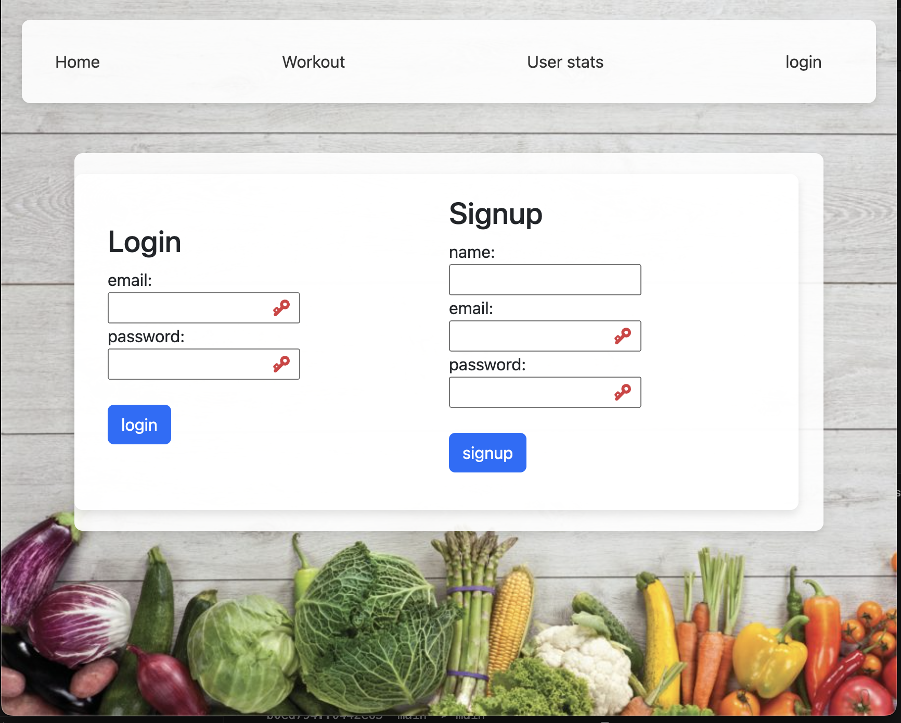

# Balance-basics

## Description

An exercise app that lets you track your workout and gives advice workouts based on BMI.

https://balance-basics62-e0d5ef0b08c5.herokuapp.com/

## Table of Contents

- [Installation](#installation)
- [Usage](#usage)
- [License](#license)
- [Contributing](#contributing)
- [Tests](#tests)
- [Questions](#questions)

## Installation

npm i, nodemon

Technologies Used:
npm,
nodejs,
expressjs,
bootstrap,
bcrypt,
dotenv,
sequelize,
handlebars,
luxon,
vanilla-calendar-pro,
mySQL 2

## Usage

https://opensource.org/licenses/MIT

## license

      This project is licensed under MIT

## Contributing

Joseph Kamil and Christopher Lowenthal

## Tests

none

## Questions

For any questions, please contact [kamilj62](https://github.com/kamilj62) on GitHub or email at kamilj@umich.edu.
